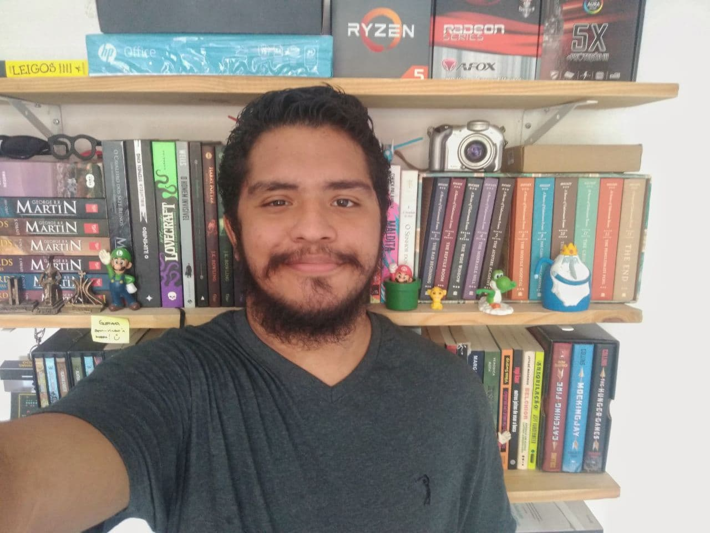
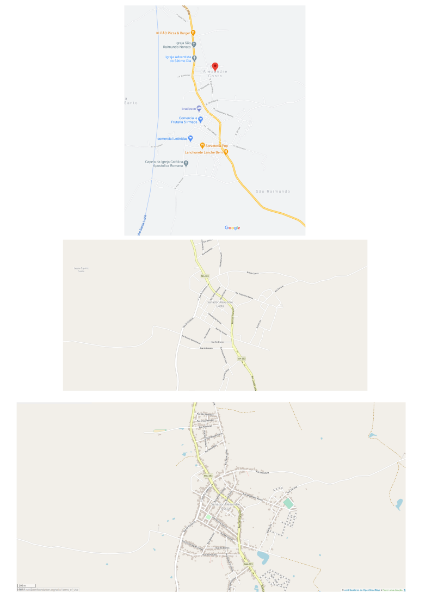

---
title: "Mapper of the Month: PlayzinhoAgro (Brazil)"
featured:
layout: post
category: motm
author: Pierre Parmentier
lang: en
---

His [homepage](https://www.openstreetmap.org/user/PlayzinhoAgro) and his [contributor page](https://hdyc.neis-one.org/?PlayzinhoAgro).

## Would you like to briefly introduce yourself to our readers?

My name is Gustavo Soares (PlayzinhoAgro). With the quarantine I ended up becoming a full-time volunteer mapper. I am also an [ElementaryOS](https://elementary.io/) fanboy and free software activist. My favourite editor has been IDv3 and I have tried to use JOSM. I have used an instance of DAMN Project, [Divide and map. Now.](https://www.damn-project.org/) as a task manager. It is a great alternative to the self-hosted HOT task manager mainly for being light. In the beginning I used it with a server with 500mb and 1vCPU being easy to install. I used to map cities in the state of Maranhão in Brazil. Currently I have been working in Timon, Maranhão where I now I live but I'm always posting new areas in the [Mapeia.space](https://tarefas.mapeia.space/).

## How and when did you get to know OpenStreetMap?

I first had the opportunity to work with OpenStreetMap in late 2019, while I was looking for alternatives to Google Maps. Before that, he had been one of the first local guides in the region. A few months later I managed to build a PC and since then I started to map almost every day.

## How do you use OpenStreetMap?

With this quarantine and the need for isolation, I use very little for navigation. Nowadays my use has been 80% editing and the other 20% seeing the rendered maps.

## What kind of contributor are you and in which area do you map?

I think I can define myself as a full-time volunteer mapper, and I map cities in my state and neighbouring regions.

## What are you mapping? Do you have a specialization?

I like to consider myself a generic mapper. For me, creating a base  map is the most important so what I end up most mapping is what you can see by satellite: buildings, roads, water, etc.

## What is your greatest achievement as mapper?

For me it ends up being two: my first 1k in OpenStreetMap, and being interviewed now for the Mapper of the Month.!

## Why are you mapping? What motivates you?

I would say that I ended up finding my place at OpenStreetMap. I have problems with attention and anxiety, and OpenStreetMap ended up helping me to feel better because it is something I can do well. I currently see it as my way of contributing to a better world and to the FLOSS community (since I have difficulties in learning to program). Sometimes I find myself thinking about someone using Strava or another application that uses OpenStreetMap as a base and finding it interesting that the map is updated with my contribution.

## Do you have any ideas to expand the OpenStreetMap community, to motivate more people to contribute?

I think we can all make the OpenStreetMap community grow by sharing its progress on its social networks; not only in OpenStreetMap groups, but also with people close to us. I think recognition among others, like Mapper of the Month Belgium, is important to keep the community motivated and making progress. What motivated me in the beginning was the Bagdes of Missing Maps. I think it would be interesting if the OpenStreetMap profile looks more like Missing Maps.

## Do you have contact with other mappers?

Yes, mainly by Telegram groups from OSM-BR.

## What is in your view the greatest strength of OpenStreetMap?

For me, the greatest strength of OpenStreetMap is that it is open software. This provides the ability to build communities of mappers around the world!

## What are the largest challenges for OpenStreetMap?

I believe that we face two major challenges: the first is that our community is still small — we need more local publishers to not only map but also to keep them up to date. The other problem is that we do not yet know the impact that the influence of Big Tech can have on OpenStreetMap.

## How to do stay on top of news about OpenStreetMap?

_WeeklyOSM_ (thanks to Portuguese translators), _reddit/OpenStreetMap_ and groups in your community.

## To conclude, is there anything else you want to share with the readers?

I would like to thank you for calling me for this interview. I invite the readers to visit and contribute to the areas of [Mapeia](https://tarefas.mapeia.space/). Currently my work is supported by donations, and if you can, make a donation: my [liberapay](https://liberapay.com/gustavo22soares).

**Thank you, Gustavo, for this interview.**
